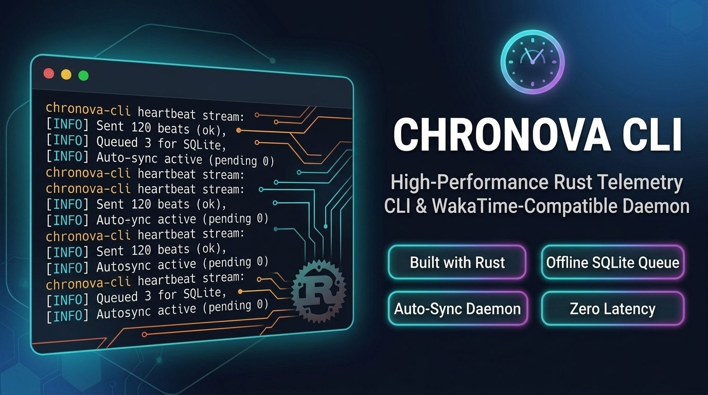

<p align="center">
  
</p>

# Quickstart

Chronova CLI is a WakaTime-compatible CLI that tracks your coding activity. It works as a drop-in replacement for `wakatime-cli` and is built in Rust for performance and reliability.

## 1. Install

Use the one-liner for your platform (from [`INSTALL.md`](../INSTALL.md)):

**Linux**
```bash
curl -fsSL https://raw.githubusercontent.com/nx-solutions-ug/chronova-cli/main/install-linux.sh | bash
```

**macOS**
```bash
curl -fsSL https://raw.githubusercontent.com/nx-solutions-ug/chronova-cli/main/install-macos.sh | bash
```

**Windows (PowerShell)**
```powershell
irm https://raw.githubusercontent.com/nx-solutions-ug/chronova-cli/main/install-windows.ps1 | iex
```

The installer places the binary in `~/.local/bin/` and creates WakaTime-compatible symlinks. Make sure `~/.local/bin` is on your PATH.

### From source

If you prefer to build it:

```bash
git clone https://github.com/nx-solutions-ug/chronova-cli.git
cd chronova-cli
cargo build --release
# Binary is at target/release/chronova-cli
```

## 2. Configure

Create or edit `~/.chronova.cfg`:

```ini
[settings]
api_key = your-api-key-here
api_url = https://chronova.dev/api/v1
```

Get your API key from [chronova.dev/settings](https://chronova.dev/settings). You can also read or write individual config keys with `--config-read <key>` and `--config-write <key> <value>`. Use `--config-section <section>` to target a config section other than the default `[settings]`.

For full configuration options, see [Configuration](./configuration/index.md).

## 3. Send a heartbeat

The simplest tracked activity looks like:

```bash
chronova-cli --entity /path/to/file.py --language python
```

With an explicit project:

```bash
chronova-cli --entity /path/to/file.rs --language rust --project my-app --lines 42
```

Most users do not call the CLI directly — editor plugins invoke it automatically. See [Editor Integration](./editor-integration/index.md) for setup.

## 4. Verify activity

Show today's coding time:

```bash
chronova-cli --today
```

Show today's total without the category breakdown:

```bash
chronova-cli --today --today-hide-categories
```

Show the number of offline heartbeats currently queued:

```bash
chronova-cli --offline-count
```

Trigger an immediate sync of offline activity:

```bash
chronova-cli --sync-offline-activity 100
```

Force sync all queued heartbeats regardless of connectivity:

```bash
chronova-cli --sync-offline-activity 100 --force-sync
```

Print the User-Agent string the CLI would send to the API:

```bash
chronova-cli --user-agent
```

Check the installed version:

```bash
chronova-cli --version
```

## Next steps

- Read the [Architecture Overview](./architecture/overview.md) to understand the internals.
- Learn about [offline behavior and retry logic](./operations/offline-sync.md).
- Explore [editor plugin setup](./editor-integration/index.md).
- See the [Development Guide](./development/index.md) for build, test, and contribution information.
