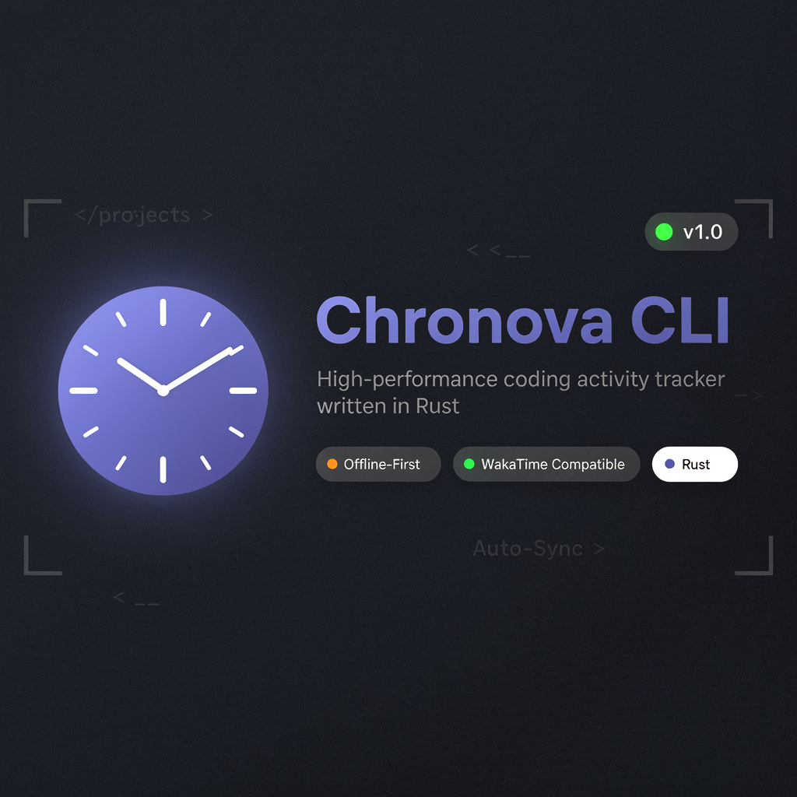

<p align="center">
  
</p>

# Chronova CLI

[](https://www.rust-lang.org/)
[](https://opensource.org/licenses/MIT)

> A high-performance, drop-in replacement for wakatime-cli written in Rust

Chronova CLI tracks your coding activity by monitoring file changes and sending heartbeat data to a Wakatime-compatible backend. Built with Rust for maximum performance and reliability.

## ✨ Features

- **⚡ High Performance**: Built in Rust with async runtime for minimal overhead
- **📡 Offline-First**: SQLite queue stores heartbeats locally when offline
- **🔌 Wakatime Compatible**: Drop-in replacement for wakatime-cli
- **🔄 Auto-Sync**: Background synchronization with retry logic
- **🔐 Multiple Auth Methods**: Supports Bearer, Basic Auth, and X-API-Key
- **🐙 Git Integration**: Automatic project and branch detection
- **📊 Language Detection**: Identifies programming languages from file extensions
- **📝 Structured Logging**: Uses tracing for detailed logs

## 🚀 Installation

### Quick Install (Recommended)

**Linux:**
```bash
curl -fsSL https://raw.githubusercontent.com/nx-solutions-ug/chronova-cli/main/install-linux.sh | bash
```

**macOS:**
```bash
curl -fsSL https://raw.githubusercontent.com/nx-solutions-ug/chronova-cli/main/install-macos.sh | bash
```

**Windows (PowerShell):**
```powershell
irm https://raw.githubusercontent.com/nx-solutions-ug/chronova-cli/main/install-windows.ps1 | iex
```

For detailed installation options, manual installation, troubleshooting, and platform-specific requirements, see **[INSTALL.md](INSTALL.md)**.

### From Source

```bash
# Clone the repository
git clone https://github.com/nx-solutions-ug/chronova-cli.git
cd chronova-cli

# Build release binary
cargo build --release

# The binary will be at target/release/chronova-cli
```

## 📖 Usage

### Basic Usage

```bash
# Track time for a file
chronova-cli --entity /path/to/file.py --language python

# Track with project detection
chronova-cli --entity /path/to/file.py --project my-project

# Track with all options
chronova-cli --entity /path/to/file.rs --language rust --project my-app --lines 42
```

### CLI Options

```bash
chronova-cli [OPTIONS]

Options:
  --entity <ENTITY>          Path to the file being edited
  --language <LANGUAGE>      Programming language (auto-detected if not specified)
  --project <PROJECT>        Project name (auto-detected from git if not specified)
  --lines <LINES>            Total lines in the file
  --lineno <LINENO>          Current line number
  --cursorpos <CURSORPOS>    Cursor position
  --write                    Mark as a write operation
  --output <OUTPUT>          Output format: json, text [default: text]
  --today                    Show today's coding time
  --version                  Show version information
  --config <CONFIG>          Path to config file
  --log-file <LOG_FILE>      Path to log file
  --sync                     Sync offline queue immediately
  --offline                  Work in offline mode only
  -h, --help                 Print help
```

## ⚙️ Configuration

Chronova CLI uses an INI configuration file located at `~/.chronova.cfg`:

```ini
[settings]
api_url = https://api.chronova.dev/api/v1
api_key = your-api-key-here
timeout = 30
hostname = my-workstation
log_file = ~/.chronova/chronova.log
```

### Configuration Precedence

Configuration is loaded in the following order (later overrides earlier):

1. Default values
2. Config file (`~/.chronova.cfg`)
3. Environment variables
4. CLI arguments

### Authentication Methods

Chronova CLI supports multiple authentication methods:

- **API Key**: Set `api_key` in config or use `CHRONOVA_API_KEY` env var
- **Bearer Token**: Use `Authorization: Bearer <token>` header
- **Basic Auth**: Username/password combination
- **X-API-Key Header**: Custom header authentication

## 🏗️ Architecture

```
┌─────────────────────────────────────────────────────────────┐
│                        Chronova CLI                         │
├─────────────────────────────────────────────────────────────┤
│  CLI Layer (cli.rs)                                        │
│  └── Clap-based argument parsing with 40+ flags            │
├─────────────────────────────────────────────────────────────┤
│  Core Layer                                                │
│  ├── Heartbeat Manager (heartbeat.rs)                      │
│  ├── Queue System (queue.rs) - SQLite storage              │
│  ├── API Client (api.rs) - HTTP with retry logic           │
│  ├── Sync Manager (sync.rs) - Background sync              │
│  └── Collector (collector.rs) - Git & language detection   │
├─────────────────────────────────────────────────────────────┤
│  Infrastructure Layer                                      │
│  ├── Config (config.rs) - INI parsing                      │
│  ├── Logger (logger.rs) - Tracing integration              │
│  └── User Agent (user_agent.rs) - Client identification    │
└─────────────────────────────────────────────────────────────┘
```

### Key Design Decisions

- **Offline-First**: Heartbeats are always queued to SQLite first, then synced
- **Async Runtime**: Tokio for handling concurrent operations
- **Trait-Based Design**: `QueueOps`, `SyncManager` traits for testability
- **Error Handling**: `thiserror` for custom errors, `anyhow` for propagation

## 🛠️ Development

### Prerequisites

- [Rust](https://rustup.rs/) (1.70+)
- [Cargo](https://doc.rust-lang.org/cargo/)

### Building

```bash
# Development build
cargo build

# Release build (optimized)
cargo build --release

# Run with verbose logging
RUST_LOG=debug cargo run -- --entity test.rs --language rust
```

### Testing

```bash
# Run all tests
cargo test

# Run with output
cargo test -- --nocapture

# Run integration tests only
cargo test --test '*'
```

### Code Quality

```bash
# Format code
cargo fmt

# Run linter
cargo clippy -- -D warnings

# Check for security vulnerabilities
cargo audit
```

## 📦 Dependencies

| Crate | Purpose |
|-------|---------|
| `clap` | CLI argument parsing |
| `tokio` | Async runtime |
| `reqwest` | HTTP client |
| `serde` | Serialization |
| `rusqlite` | SQLite bindings |
| `git2` | Git integration |
| `anyhow` | Error handling |
| `tracing` | Logging |

## 📄 License

This project is licensed under the MIT License - see the [LICENSE](LICENSE) file for details.

## 🙏 Acknowledgments

- Inspired by [wakatime-cli](https://github.com/wakatime/wakatime-cli)
- Built with the amazing Rust ecosystem

## 📞 Support

For questions or support, please:

- 💬 Email us at support@chronova.dev
- 🐛 Report issues on [GitHub](https://github.com/nx-solutions-ug/chronova-cli/issues)
- 📖 [Read the documentation](https://chronova.dev/docs)

---

<p align="center">
  Made with ❤️ by the Chronova Team
</p>
